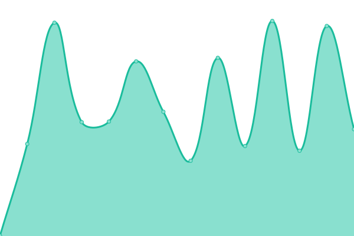

# [📈 Live Status](https://aalaraj-biotrack.github.io/status-page): <!--live status--> **🟩 All systems operational**

This repository contains the open-source uptime monitor and status page for [aalaraj-biotrack](https://aalaraj-biotrack.github.io/status-page), powered by [Upptime](https://github.com/upptime/upptime).

With [Upptime](https://upptime.js.org), you can get your own unlimited and free uptime monitor and status page, powered entirely by a GitHub repository. We use [Issues](https://github.com/aalaraj-biotrack/status-page/issues) as incident reports, [Actions](https://github.com/aalaraj-biotrack/status-page/actions) as uptime monitors, and [Pages](https://aalaraj-biotrack.github.io/status-page) for the status page.

<!--start: status pages-->
<!-- This summary is generated by Upptime (https://github.com/upptime/upptime) -->
<!-- Do not edit this manually, your changes will be overwritten -->
<!-- prettier-ignore -->
| URL | Status | History | Response Time | Uptime |
| --- | ------ | ------- | ------------- | ------ |
|  [arstems-arkansas-gov](https://arstems.arkansas.gov) | 🟩 Up | [arstems-arkansas-gov.yml](https://github.com/aalaraj-biotrack/status-page/commits/HEAD/history/arstems-arkansas-gov.yml) | 

 297ms
     
 | 

<a href="https://aalaraj-biotrack.github.io/status-page/history/arstems-arkansas-gov">100.00%</a>
    

|  [mmj-adh-arkansas-gov](https://mmj.adh.arkansas.gov) | 🟩 Up | [mmj-adh-arkansas-gov.yml](https://github.com/aalaraj-biotrack/status-page/commits/HEAD/history/mmj-adh-arkansas-gov.yml) | 

 231ms
     
 | 

<a href="https://aalaraj-biotrack.github.io/status-page/history/mmj-adh-arkansas-gov">100.00%</a>
    

|  [arstems-security-tags](https://arstems.arkansas.gov/security-tags/) | 🟩 Up | [arstems-security-tags.yml](https://github.com/aalaraj-biotrack/status-page/commits/HEAD/history/arstems-security-tags.yml) | 

 73ms
     
 | 

<a href="https://aalaraj-biotrack.github.io/status-page/history/arstems-security-tags">100.00%</a>
    

|  [transport-ar-biotrackthc-net](https://transport.ar.biotrackthc.net) | 🟩 Up | [transport-ar-biotrackthc-net.yml](https://github.com/aalaraj-biotrack/status-page/commits/HEAD/history/transport-ar-biotrackthc-net.yml) | 

 524ms
     
 | 

<a href="https://aalaraj-biotrack.github.io/status-page/history/transport-ar-biotrackthc-net">100.00%</a>
    

|  [server-biotrackthc-net](https://server.biotrackthc.net) | 🟩 Up | [server-biotrackthc-net.yml](https://github.com/aalaraj-biotrack/status-page/commits/HEAD/history/server-biotrackthc-net.yml) | 

 372ms
     
 | 

<a href="https://aalaraj-biotrack.github.io/status-page/history/server-biotrackthc-net">100.00%</a>
    

|  [mcmonitoring-agr-illinois-gov](https://mcmonitoring.agr.illinois.gov) | 🟩 Up | [mcmonitoring-agr-illinois-gov.yml](https://github.com/aalaraj-biotrack/status-page/commits/HEAD/history/mcmonitoring-agr-illinois-gov.yml) | 

 454ms
     
 | 

<a href="https://aalaraj-biotrack.github.io/status-page/history/mcmonitoring-agr-illinois-gov">100.00%</a>
    

|  [il-uat01-biotrackthc-net](https://il-uat01.biotrackthc.net) | 🟩 Up | [il-uat01-biotrackthc-net.yml](https://github.com/aalaraj-biotrack/status-page/commits/HEAD/history/il-uat01-biotrackthc-net.yml) | 

 297ms
     
 | 

<a href="https://aalaraj-biotrack.github.io/status-page/history/il-uat01-biotrackthc-net">100.00%</a>
    

|  [uat-api-licensee-fl-biotr-ac-heartbeat](https://uat.api.licensee.fl.biotr.ac/heartbeat) | 🟩 Up | [uat-api-licensee-fl-biotr-ac-heartbeat.yml](https://github.com/aalaraj-biotrack/status-page/commits/HEAD/history/uat-api-licensee-fl-biotr-ac-heartbeat.yml) | 

 470ms
     
 | 

<a href="https://aalaraj-biotrack.github.io/status-page/history/uat-api-licensee-fl-biotr-ac-heartbeat">100.00%</a>
    

|  [qa-api-licensee-fl-biotr-ac-heartbeat](https://qa.api.licensee.fl.biotr.ac/heartbeat) | 🟩 Up | [qa-api-licensee-fl-biotr-ac-heartbeat.yml](https://github.com/aalaraj-biotrack/status-page/commits/HEAD/history/qa-api-licensee-fl-biotr-ac-heartbeat.yml) | 

 341ms
     
 | 

<a href="https://aalaraj-biotrack.github.io/status-page/history/qa-api-licensee-fl-biotr-ac-heartbeat">100.00%</a>
    

|  [mcp-tracking-nmhealth-org](https://mcp-tracking.nmhealth.org) | 🟩 Up | [mcp-tracking-nmhealth-org.yml](https://github.com/aalaraj-biotrack/status-page/commits/HEAD/history/mcp-tracking-nmhealth-org.yml) | 

 509ms
     
 | 

<a href="https://aalaraj-biotrack.github.io/status-page/history/mcp-tracking-nmhealth-org">100.00%</a>
    

|  [mcp-patient-tracking-nmhealth-org](https://mcp-patient-tracking.nmhealth.org) | 🟩 Up | [mcp-patient-tracking-nmhealth-org.yml](https://github.com/aalaraj-biotrack/status-page/commits/HEAD/history/mcp-patient-tracking-nmhealth-org.yml) | 

 277ms
     
 | 

<a href="https://aalaraj-biotrack.github.io/status-page/history/mcp-patient-tracking-nmhealth-org">100.00%</a>
    

|  [hicsts-hawaii-gov](https://hicsts.hawaii.gov) | 🟩 Up | [hicsts-hawaii-gov.yml](https://github.com/aalaraj-biotrack/status-page/commits/HEAD/history/hicsts-hawaii-gov.yml) | 

 418ms
     
 | 

<a href="https://aalaraj-biotrack.github.io/status-page/history/hicsts-hawaii-gov">100.00%</a>
    

|  [mmp-sts-cannabis-ny-gov](https://mmp-sts.cannabis.ny.gov) | 🟩 Up | [mmp-sts-cannabis-ny-gov.yml](https://github.com/aalaraj-biotrack/status-page/commits/HEAD/history/mmp-sts-cannabis-ny-gov.yml) | 

 240ms
     
 | 

<a href="https://aalaraj-biotrack.github.io/status-page/history/mmp-sts-cannabis-ny-gov">88.33%</a>
    

|  [delaware-biotrackthc-net](https://delaware.biotrackthc.net) | 🟩 Up | [delaware-biotrackthc-net.yml](https://github.com/aalaraj-biotrack/status-page/commits/HEAD/history/delaware-biotrackthc-net.yml) | 

 592ms
     
 | 

<a href="https://aalaraj-biotrack.github.io/status-page/history/delaware-biotrackthc-net">100.00%</a>
    

|  [delaware-biotrackthc-patients](https://delaware.biotrackthc.net/patients/) | 🟩 Up | [delaware-biotrackthc-patients.yml](https://github.com/aalaraj-biotrack/status-page/commits/HEAD/history/delaware-biotrackthc-patients.yml) | 

 60ms
     
 | 

<a href="https://aalaraj-biotrack.github.io/status-page/history/delaware-biotrackthc-patients">100.00%</a>
    

|  [cannabispr-biotrackthc-net](https://cannabispr.biotrackthc.net) | 🟩 Up | [cannabispr-biotrackthc-net.yml](https://github.com/aalaraj-biotrack/status-page/commits/HEAD/history/cannabispr-biotrackthc-net.yml) | 

 302ms
     
 | 

<a href="https://aalaraj-biotrack.github.io/status-page/history/cannabispr-biotrackthc-net">100.00%</a>
    

|  [mminventory-health-nd-gov](https://mminventory.health.nd.gov) | 🟩 Up | [mminventory-health-nd-gov.yml](https://github.com/aalaraj-biotrack/status-page/commits/HEAD/history/mminventory-health-nd-gov.yml) | 

 437ms
     
 | 

<a href="https://aalaraj-biotrack.github.io/status-page/history/mminventory-health-nd-gov">100.00%</a>
    

|  [mmregistration-health-nd-gov](https://mmregistration.health.nd.gov) | 🟩 Up | [mmregistration-health-nd-gov.yml](https://github.com/aalaraj-biotrack/status-page/commits/HEAD/history/mmregistration-health-nd-gov.yml) | 

 381ms
     
 | 

<a href="https://aalaraj-biotrack.github.io/status-page/history/mmregistration-health-nd-gov">100.00%</a>
    

|  [ndtags-biotrackthc-com](https://ndtags.biotrackthc.com) | 🟩 Up | [ndtags-biotrackthc-com.yml](https://github.com/aalaraj-biotrack/status-page/commits/HEAD/history/ndtags-biotrackthc-com.yml) | 

 443ms
     
 | 

<a href="https://aalaraj-biotrack.github.io/status-page/history/ndtags-biotrackthc-com">100.00%</a>
    

|  [nhcannabisregistry-biotrackthc-com](https://nhcannabisregistry.biotrackthc.com) | 🟩 Up | [nhcannabisregistry-biotrackthc-com.yml](https://github.com/aalaraj-biotrack/status-page/commits/HEAD/history/nhcannabisregistry-biotrackthc-com.yml) | 

 245ms
     
 | 

<a href="https://aalaraj-biotrack.github.io/status-page/history/nhcannabisregistry-biotrackthc-com">100.00%</a>
    

|  [patients-va-biotr-ac](https://patients.va.biotr.ac) | 🟩 Up | [patients-va-biotr-ac.yml](https://github.com/aalaraj-biotrack/status-page/commits/HEAD/history/patients-va-biotr-ac.yml) | 

 298ms
     
 | 

<a href="https://aalaraj-biotrack.github.io/status-page/history/patients-va-biotr-ac">100.00%</a>
    

|  [products-va-biotr-ac](https://products.va.biotr.ac) | 🟩 Up | [products-va-biotr-ac.yml](https://github.com/aalaraj-biotrack/status-page/commits/HEAD/history/products-va-biotr-ac.yml) | 

 246ms
     
 | 

<a href="https://aalaraj-biotrack.github.io/status-page/history/products-va-biotr-ac">100.00%</a>
    

|  [wm01-biotrackthc-net](https://wm01.biotrackthc.net) | 🟩 Up | [wm01-biotrackthc-net.yml](https://github.com/aalaraj-biotrack/status-page/commits/HEAD/history/wm01-biotrackthc-net.yml) | 

 712ms
     
 | 

<a href="https://aalaraj-biotrack.github.io/status-page/history/wm01-biotrackthc-net">100.00%</a>
    

|  [trace-ct-biotr-ac](https://trace.ct.biotr.ac) | 🟩 Up | [trace-ct-biotr-ac.yml](https://github.com/aalaraj-biotrack/status-page/commits/HEAD/history/trace-ct-biotr-ac.yml) | 

 314ms
     
 | 

<a href="https://aalaraj-biotrack.github.io/status-page/history/trace-ct-biotr-ac">100.00%</a>
    

<!--end: status pages-->

[**Visit our status website →**](https://aalaraj-biotrack.github.io/status-page)

## 📄 License

- Powered by: [Upptime](https://github.com/upptime/upptime)
- Code: [MIT](./LICENSE) © [Anand Chowdhary](https://anandchowdhary.com), supported by [Pabio](https://pabio.com)
- Data in the `./history` directory: [Open Database License](https://opendatacommons.org/licenses/odbl/1-0/)
